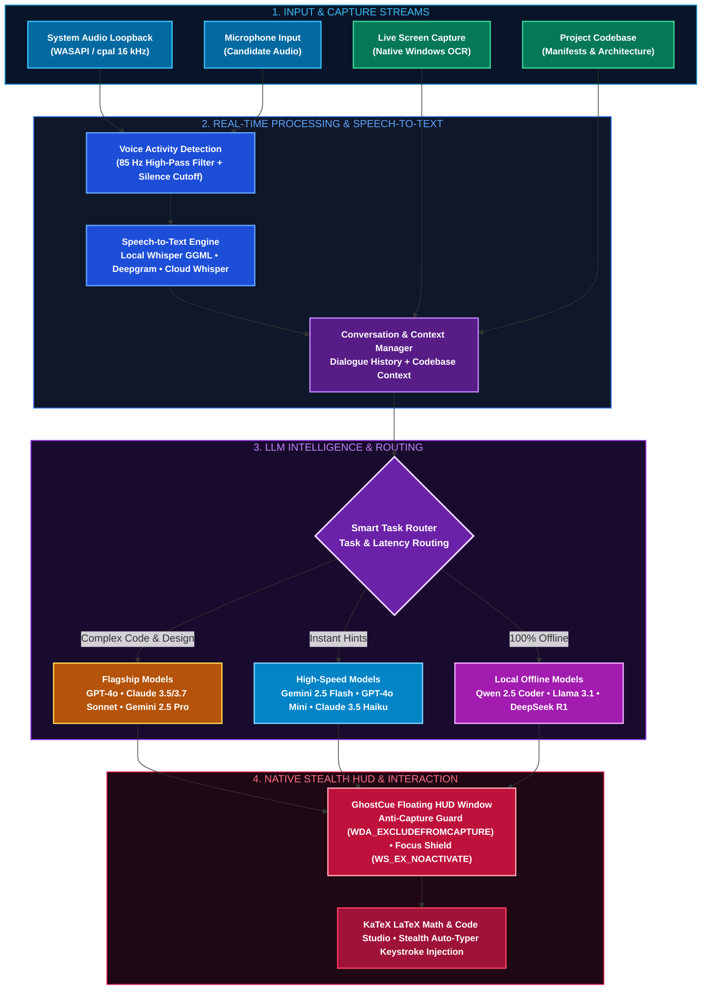
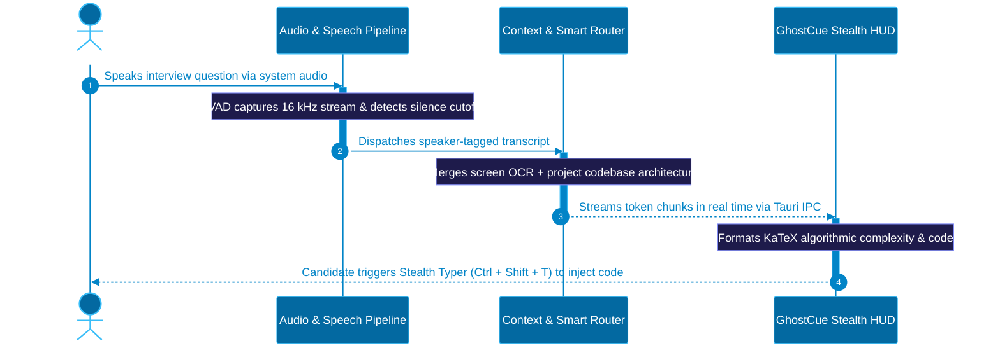

<p align="center">
  
</p>

<h1 align="center">GhostCue</h1>

<p align="center">
  <a href="https://tauri.app"></a>
  <a href="https://www.rust-lang.org"></a>
  <a href="https://react.dev"></a>
  <a href="https://www.typescriptlang.org"></a>
  <a href="LICENSE"></a>
  
</p>

<p align="center">
  <strong>Lightweight, uncapturable desktop HUD and AI interview copilot with real-time dual audio transcription, local OCR screen capture, and multi-model LLM orchestration.</strong>
</p>

<p align="center">
  
</p>

## Overview

GhostCue is a high-performance, low-latency desktop assistant designed for real-time technical assessment practice, technical interview preparation, and speech accessibility. Built on a native **Rust (Tauri v2)** backend paired with a **React 19 / TypeScript** user interface, GhostCue captures both sides of a conversation via system audio loopback and microphone, transcribes speech in real time, and synthesizes contextual hints, algorithmic solutions, and architectural breakdowns on demand.

<p align="center">
  
</p>

## Pre-Built Installers

Standalone Windows binaries and setup packages are available directly in the root directory:

| Package Format | Target Platform | Architecture | Installer File |
| :--- | :--- | :--- | :--- |
| **NSIS Setup Installer** | Windows 10 / 11 | x64 | [`GhostCue_0.1.0_x64-setup.exe`](./GhostCue_0.1.0_x64-setup.exe) |
| **Windows MSI Package** | Windows 10 / 11 | x64 | [`GhostCue_0.1.0_x64_en-US.msi`](./GhostCue_0.1.0_x64_en-US.msi) |

To get started immediately without compiling from source, run either installer.

<p align="center">
  
</p>

## System Architecture

The following diagram illustrates the complete audio capture, speech transcription, context aggregation, model routing, and native desktop presentation pipelines:



<p align="center">
  
</p>

## Event Lifecycle

The interaction flow from audio capture to the simulated typing of a solution is structured as follows:



<p align="center">
  
</p>

## Key Features

### 1. Window Protection and Stealth
* **Operating System Anti-Capture:** Employs Windows `SetWindowDisplayAffinity(WDA_EXCLUDEFROMCAPTURE)` and macOS `NSWindowSharingNone`. The HUD window is excluded from screen recordings, window shares, and conference software such as Zoom, Microsoft Teams, Google Meet, Discord, and OBS.
* **Focus Shield (`WS_EX_NOACTIVATE`):** Moving or interacting with the HUD does not steal focus from the primary development environment, browser, or code assessment terminal.
* **Click-Through Mode:** Pass mouse clicks through the HUD directly to the applications running underneath.
* **Stealth Typer:** Simulates natural character-by-character keyboard input directly into any active editor or assessment interface.

### 2. Dual-Channel Audio and Speech-to-Text
* **Concurrent Audio Capture:**
  * **Interviewer Audio:** Captures remote audio through low-latency system loopback via `cpal` WASAPI on Windows.
  * **Candidate Audio:** Concurrently captures local microphone input.
  * Resamples incoming streams to standardized 16 kHz mono 32-bit float PCM.
* **Voice Activity Detection (VAD):**
  * Energy-based detection with zero-crossing rate analysis and an 85 Hz high-pass rumble filter.
  * Pre-roll buffering retains word-initial consonants; dynamic silence thresholds avoid splitting sentences prematurely.
* **Flexible STT Engines:**
  * **Local Offline:** Quantized Whisper GGML models (`tiny`, `base`, `small`, `medium`, `large-v3-turbo`) executing entirely on-device.
  * **Cloud Fallback:** Deepgram Nova-2 streaming WebSocket or OpenAI/Groq Cloud Whisper.
  * Automatic speaker diarization tagging (`Interviewer:` vs `Candidate:`).
  * Multi-language support across English, Filipino, Spanish, Chinese, Japanese, German, French, Portuguese, Korean, Russian, Hindi, and Arabic.

### 3. Intelligence and Multi-Provider LLM
* **Broad Provider Support:** Google Gemini (`gemini-2.5-flash`, `gemini-2.5-pro`, `gemini-2.0-flash`, `gemini-1.5-pro`), OpenAI (`gpt-4o`, `gpt-4o-mini`, `o3-mini`, `o1`), Anthropic Claude (`claude-3-5-sonnet`, `claude-3-7-sonnet`, `claude-3-5-haiku`), Groq (`llama-3.3-70b`), and Ollama (local offline models).
* **Smart Model Routing:** Directs complex tasks such as algorithmic generation and architecture design to flagship models while routing rapid hints to low-latency variants.
* **Auto-Trigger Assistant:** Automatically detects when the interviewer has finished speaking and generates timely answers without manual intervention.
* **Local Screen OCR:** Extracts text directly from the active display buffer via native Windows OCR, avoiding repetitive vision token costs.
* **Mathematical Notation:** Formats algorithmic complexity analysis, asymptotic bounds ($O(N \log N)$), and proofs using KaTeX LaTeX typesetting.

### 4. Context and Session History
* **Project Context Scanner:** Indexes local project directories, parsing key manifests (`package.json`, `Cargo.toml`, `go.mod`, `README.md`) to integrate repository architecture into LLM responses.
* **Session Persistence:** Retains question transcripts, candidate queries, and generated solutions with filtering, search, and one-click plain-text export.

<p align="center">
  
</p>

## Global Shortcuts

All shortcuts can be reconfigured or customized in the Settings panel:

| Hotkey | Action | Description |
| :--- | :--- | :--- |
| `Ctrl + Shift + H` | **Panic Hide / Restore** | Toggles HUD window visibility immediately |
| `Ctrl + Shift + C` | **Click-Through** | Enables mouse click pass-through to windows below |
| `Ctrl + Shift + F` | **Focus Shield** | Enables non-activating window mode to prevent stealing keyboard focus |
| `Ctrl + Shift + P` | **Pause / Resume** | Pauses or resumes audio capture and automatic LLM triggers |
| `Ctrl + Shift + M` | **Mute Microphone** | Toggles candidate microphone mute state |
| `Ctrl + Shift + Space`| **Instant Hint** | Triggers prompt generation based on current conversation context |
| `Ctrl + Shift + K` | **Code Solution** | Generates an algorithmic solution with complexity breakdown |
| `Ctrl + Shift + L` | **Clarifying Questions** | Formulates strategic clarifying questions for the interviewer |
| `Ctrl + Shift + E` | **System Design** | Generates architecture diagrams, scaling points, and trade-off notes |
| `Ctrl + Shift + S` | **Screen Vision** | Captures the active monitor and extracts problem text via OCR |
| `Ctrl + Shift + O` | **Live OCR Auto-Scan** | Toggles periodic background screen inspection |
| `Ctrl + Shift + T` | **Stealth Typer** | Types the latest code block into the currently focused editor |
| `Esc` | **Stop / Dismiss** | Halts active LLM streaming or dismisses open overlays |

<p align="center">
  
</p>

## Building From Source

### Prerequisites
1. **Node.js**: v18 or later (v22+ LTS recommended)
2. **Rust & Cargo**: v1.75 or later (`rustup`)
3. **Platform Build Tools**:
   * **Windows 10 / 11:** Visual Studio 2022 C++ Build Tools (with Windows 10/11 SDK)

### Installation
```bash
# 1. Clone the repository
git clone https://github.com/Aera0908/GhostCue.git
cd GhostCue

# 2. Install frontend dependencies
npm install

# 3. Create environment file from template
cp .env.example .env
```

### Development Mode
```bash
# Runs the Vite dev server and native Tauri desktop window concurrently
npm run tauri dev
```

### Production Build
```bash
# Compiles the optimized binary and installer packages
npm run tauri build
```
Compiled setup bundles and binaries are placed into `src-tauri/target/release/bundle/`.

<p align="center">
  
</p>

## Configuration Reference

Settings can be managed either through the in-app interface (`Ctrl + ,`) or by configuring the `.env` file:

```env
# Primary LLM Provider: "gemini" | "openai" | "anthropic" | "deepseek" | "groq" | "ollama" | "custom"
LLM_PROVIDER=gemini

# Google Gemini
GEMINI_API_KEY=
GEMINI_MODEL=gemini-2.5-flash

# OpenAI
OPENAI_API_KEY=
OPENAI_MODEL=gpt-4o
OPENAI_BASE_URL=https://api.openai.com/v1

# Anthropic Claude
ANTHROPIC_API_KEY=
ANTHROPIC_MODEL=claude-3-5-sonnet-20241022

# DeepSeek
DEEPSEEK_API_KEY=
DEEPSEEK_MODEL=deepseek-chat

# Groq
GROQ_API_KEY=

# Ollama (Local & Offline)
OLLAMA_ENDPOINT=http://localhost:11434
OLLAMA_MODEL=qwen2.5-coder:7b

# Custom / OpenRouter / Mistral / xAI / Cohere / Qwen
CUSTOM_ENDPOINT=https://openrouter.ai/api/v1
CUSTOM_API_KEY=
CUSTOM_MODEL=deepseek/deepseek-r1

# Smart Model Routing (routes complex coding/vision tasks to flagship models)
SMART_MODEL_ROUTING=true

# Speech-to-Text: "local_whisper" | "deepgram" | "cloud_whisper"
STT_PROVIDER=local_whisper
DEEPGRAM_API_KEY=

# Auto-answer trigger delay in milliseconds after speaker finishes
AUTO_TRIGGER_DELAY_MS=1500

# Periodic Screen OCR
LIVE_OCR_ENABLED=false
LIVE_OCR_INTERVAL_SECS=10
```

<p align="center">
  
</p>

## Privacy and Local Operation

* **Full Offline Operation:** Pairing **Local Whisper GGML** with **Ollama** allows GhostCue to operate completely without internet connectivity. No audio buffers, transcripts, or queries leave your device.
* **Transparent Local Storage:** Configuration parameters, audio logs, and session history remain strictly on the local machine in standard system application directories.
* **Zero Telemetry:** GhostCue contains no third-party tracking, diagnostic beacons, or analytics collectors.

<p align="center">
  
</p>

## License and Disclaimer

Distributed under the **MIT License**. See `LICENSE` for further terms.

**Disclaimer:** GhostCue is developed as a technical interview preparation aid, practice tool, and accessibility copilot. Users are responsible for complying with the policies, codes of conduct, and terms of service of their prospective employers, academic institutions, and assessment platforms.
